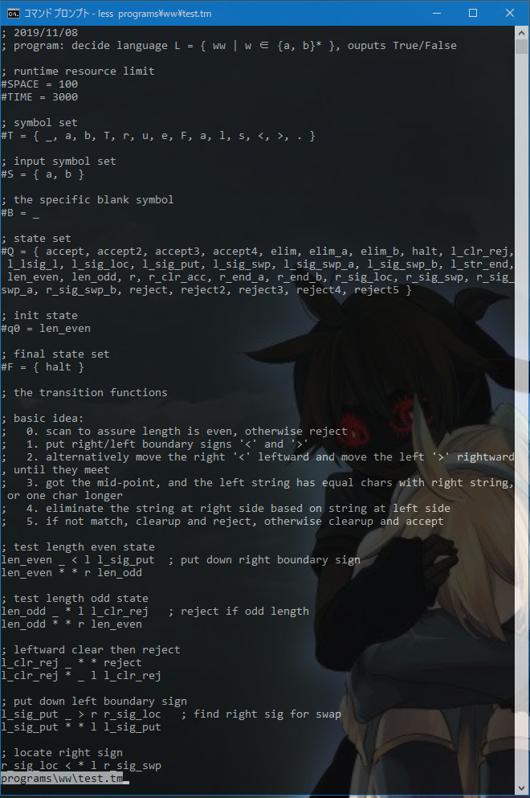
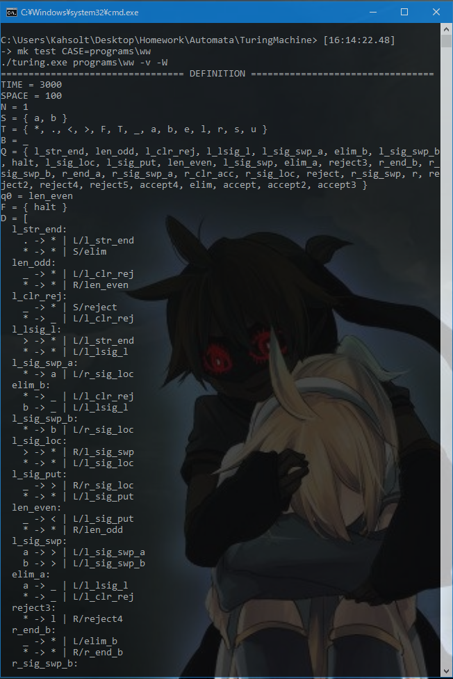
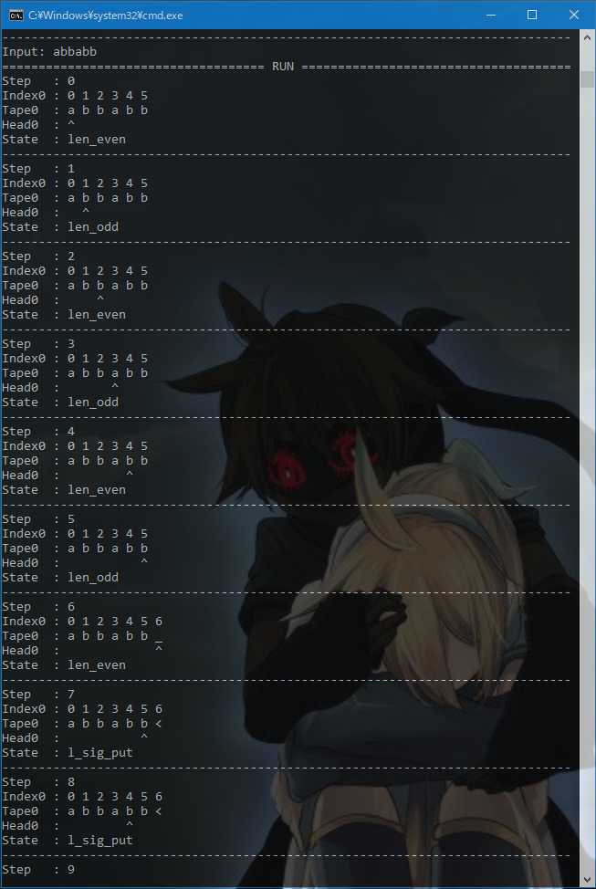
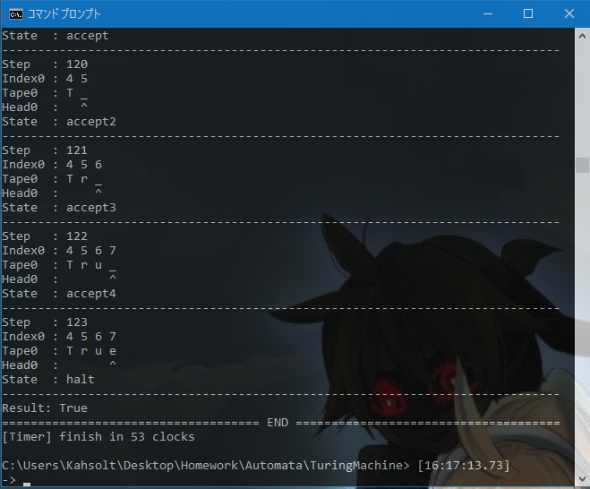
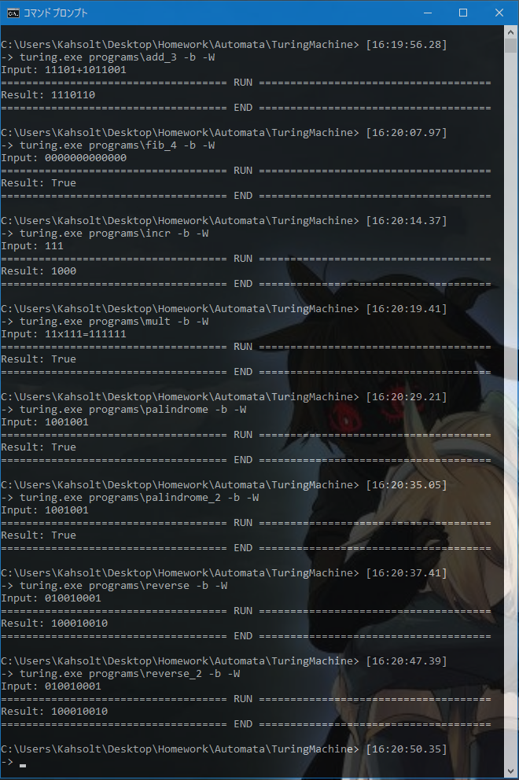

# 图灵机模拟器

    这是个标准双向无限多带图灵机模拟器的C++实现
    你可以按照给定的语法规范编写自己的图灵机程序、测试并运行 :)

----

题目在这里: [TM-Problem.pdf](/TM-Problem.pdf)

## 图灵机模拟器

> **对应任务一和任务二**

### 形式语言描述

在基本要求的基础上做了些许增强：

  - 除了**转移函数规则**以外的所有定义项(`#`开头的行)都**不必**显式地写出，因为它们可以合理地**从转移函数中推断**出来、或者使用**默认值**，你只需要关注转移函数规则集就行了 :)
  - 增加了定义项`#TIME`和`#SPACE`，以约束图灵机运行时的资源使用

[语法设计](/programs/syntax.tm)详说：

```
; This is a sample TM definition file
; as you can see, comma marks a line comment
;   by Armit - 2019/11/8
;

; definition item names starts with '#', namely they are:
;   #N =        number of tapes; default: 1
;   #B =        blank cell symbol; default: '_'
;   #T = { }    symbol set, alias is '#G', implict containing '#B'
;   #S = { }    symbol set of input data, input will be validated firstly if this is defined
;   #Q = { }    state set
;   #q = { }    init state, alias is '#q0'; default: 'init' 
;   #F = { }    halt state set; default: '{ halt }'
;   #TIME =     time limit (aka. transition step counts); default: see [config.h](/src/config.h)
;   #SPACE =    space limit (aka. cell count of the tape which is accessed); default: see [config.h](/src/config.h)
; these items are **NOT** neccessary since they have default values 
; or they could be infered from transition function rules
; (naming rule: symbols are single literal chars, states are literal strings)
;

#S = { 0, 1 }   ; enable input validation

; transition functions rules are vital, each of them is defined as a five-tuple:
;   <cur_state> <cur_symbol> <new_symbol> <move_direction> <new_state>
; wildcard '*' could be used for:
;   - cur_symbol: meaning 'for any content of the cell'
;   - new_symbol: meaning 'no overwrite on this cell'
;   - move_direction: meaning just stick here, no movement
;

; here just write some 0 and 1
init 0 1 l wrt_0
init 1 0 r wrt_1

wrt_0 * 0 r init
wrt_1 * 1 * halt

; if you wanna a multi-tape machine, then the transition functions rules will become:
;   <cur_state> <cur_symbols> <new_symbols> <move_directions> <new_state>
; where symbols and directions are given as a continous string without seperators
;

; here we just do a copy
init ** ** ** cpy   ; state shift

cpy _* ** ll halt
cpy 0* *0 rr cpy
cpy 1* *1 rr cpy
```

### 图灵机对象

从由**形式语言描述的图灵机文件**得到一个由**C++语言描述的图灵机对象**，需要一个解析过程

由于上述描述文件的语法十分简单，[词法分析](/src/Tokenizer.h)和[语法分析](/src/Parser.h)都只是一些字符串处理，仅贴出语法解析器类结构、可见就是简单地针对每种定义去做相应的解析；源码简单易懂、不作冗余说明：

```cpp
class Parser {
private:
  Tokenizer tokenizer;
  char* line; int lineno;
  TuringMachine *tm;  // `for tm->strpool.intern()`
public:
  TuringMachine* parse(string fdeffp);
private:
  void extract_number(size_t &i);
  void extract_symbol(Symbol &s);
  void extract_symbol_set(set<Symbol> &s);
  void extract_state(State* &s);
  void extract_state_set(set<State*> &s);
  void extract_transition(map<State*, map<Symbols*, Transition>> &m);
};
```

而代表[图灵机](/src/TuringMachine.h)的类结构如下(节选)：

```cpp
class TuringMachine {
private:
  /* definition */
  size_t N;             // number of tapes
  set<Symbol> T;        // symbol set
  set<Symbol> S;        // input symbol set
  Symbol B;             // blank symbol
  set<State*> Q;        // state set
  State *q0;            // start state
  set<State*> F;        // halt state set 
  map<State*, map<Symbols*, Transition>> D;  // transfer function
  /* device */
  ifstream fin;         // I/O devices
  ofstream fout;
  ofstream ferr;
  size_t limit_time;    // resource limit
  size_t limit_space;
  /* runtime */
  size_t steps;         // step counter, init: 0
  State *q;             // current state, init: q0
  vector<Tape> tapes;   // the infinite tapes, tapes.size() == N
private:
  StringPool strpool;   // optimize: reuse const string objects

private:
  TuringMachine();  // cannot publically create this object, only via Parser::parse
public:
  void run(string finfp, string foutfp, string ferrfp);
private:
  inline void setup(string finfp, string foutfp, string ferrfp);
  inline bool check_input();
  inline void launch();
  inline void teardown();

private:
  void print_text(string text, bool newline=true, bool output=false);
};
```

可见一个图灵机的数据结构主要有以下三部分组成：

  - 定义definition：即对应的源描述文件中，形式语言元组表示的图灵机定义
  - 设备device：使用的I/O设备（不是纸带，而是纸带内容的信息源）
  - 运行时runtime：运行时的当前格局信息，包括状态、纸带、计步数

提供的操作只有一个，就是运行`run`，而这又可拆分成四个子过程：

  - setup：打开I/O设备，重置运行时格局信息
  - check_input：装载输入文件内容到第一条纸带，并检查串的合法性
  - lauch：单步执行该图灵机，并进行相应的I/O操作
  - teardown：关闭I/O设备

另外也在基本要求的基础上做了些许增强：

  - 可以打印该图灵机的定义，以检查解析是否出错(见私有`void print_definition();`)
  - 用到了字符串资源池的小技巧以一定程度上优化性能(见`StringPool strpool;`)

### 主函数：图灵机API的使用

[典型的用法](/src/main.cpp)如下：

```cpp
int main(int argc, char* argv[]) {
  CmdOpts opts = parse_cmd(argc, argv);

  ios::sync_with_stdio(false);  // fixup
  try {
    clock_t t = clock();  // compile usually takes just 1 clock 
    TuringMachine* tm = Parser().parse(opts.base_path + DEFINITION_FILENAME);
    tm->opts(opts.level);
    tm->run((            opts.base_path + INPUT_FILENAME),
            (opts.save ? opts.base_path + OUTPUT_FILENAME : NULL_DEVICE),
            (opts.save ? opts.base_path + DEBUG_FILENAME : NULL_DEVICE));
    if (opts.level == VERBOSE) cout << "[Timer] finish in " << clock() - t << " clocks" << endl;
    delete tm;
  } catch (TMException* ex) {
    cerr << ex->what() << endl;
    exit(-1);
  }
}
```

逻辑流程：

  1. 首先，解析命令行运行参数到结构体`CmdOpts`以备用，这包括用例目录、日志等级
  2. 然后，图灵机对象通过解析图灵机描述文件而得到、然后放入IO设备的地址(这里是文件名或者`/dev/null`)就可以跑了；外部用`try..catch..`包裹，以捕捉语法错误或者运行时异常
  3. 最后，计时器可以显示程序的运行时间，这个实现的效率还可以：所有测试程序在测试样例输入上的运行时间都不超过`50 clock`

### 内核实现：launch()函数

虽然从实现上说，最难的、最繁琐的是处理打印信息的排版问题，但逻辑上最重要的还是图灵机执行的内核，也就是上述中的`lanuch()`函数，稍微预览一下大纲：

```lua
function lanuch()
  -- 只要不在终止状态
  while (current_state not in final_state_set) {
    -- 检查时空资源约束
    if exceed_resource_limit() then break end
    print_configuration()   -- 打印当前终末格局
    
    -- 寻找基于当前状态的转移函数规则集
    let ruleset = find_ruleset_by_current_state()
    if not ruleset then error() end
    
    -- 选择规则集中距离当前带头符号串最精确(通配符尽可能少)的规则
    let rule = find_most_exact_rule(ruleset)
    if not rule then error() end

    -- 应用这个规则：对每条带子读写单元格、移动带头，然后更新转台
    for tape in tapes do
      tape[head] = rule.new_symbol
      tape.head += rule.direction
    end
    current_state = rule.new_state
  }
  print_configuration() -- 补上终末格局
  print_tape0()         -- 打印结果(第一条纸带)
end
```

这是真实世界的全部细节：

```cpp
inline void TuringMachine::launch() {
  print_section("RUN");

  while (F.find(q) == F.end()) {
    if (level != BRIEF) { print_configuration(); } steps++;
    for (auto &tape : tapes) if (limit_space > 0 && tape.size() > limit_space) throw new RuntimeError("space limit exceeded");
    if (limit_time > 0 && steps > limit_time) throw new RuntimeError("time limit exceeded");

    // find tx for state
    auto sst = D.find(q);
    if (sst == D.end()) throw new RuntimeError("no transitions on state " + quote(*q));

    // find tx for (state, symbols)
    sb_reset();
    for (auto &tape : tapes) sb << *tape.head;
    string cur_syms = sb.str();
    int len = cur_syms.length();

    Transition* tx = nullptr; int minwc = len + 1; // use wildcards as less as possible
    for (auto &st : sst->second) {
      Symbols syms = *st.first;
      int wc = 0;
      for (int i=0; wc!=-1 && i<=len; i++)
        if (cur_syms[i] != syms[i]) {
          if (syms[i] == WILDCARD_MARK) wc++; // allow wildcards
          else wc = -1;                       // fail if mismatch
        }
      if (wc != -1 && wc <= minwc) {
        tx = &st.second; minwc = wc;
      }
    }
    if (!tx) throw new RuntimeError("no transition on state " + quote(*q) + " of symbol(s) " + quote(cur_syms));

    // apply this tx
    for (size_t i=0; i<tapes.size(); i++) {
      auto &tape = tapes[i];
      if ((*tx->symbols_new)[i] != WILDCARD_MARK) *tape.head = (*tx->symbols_new)[i];
      switch (to_enum((*tx->directions)[i])) {
        case RIGHT:
          if (tape.head + 1 == tape.end())
            tape.push_back(B);
          tape.head += 1;
          break;
        case LEFT:
          if (tape.head == tape.begin())
            tape.push_front(B);
          tape.head -= 1;
          break;
        case STALL: break;
      }
    }
    q = tx->state_next; // state shift
  }

  if (level != BRIEF) print_configuration();  // the last step
  print_text("Result: ", false); print_tape0();
}
```

## 图灵机程序设计

> **对应任务三**

### 斐波拉契数判定机(fib_4)

题目：设计语言`L = { 0^k | k是一个斐波拉契数 }`的判定器

解决思想：
  - 依次产生每个斐波拉契数的一进制表示串，这需要**三条带子**来分别存储fib(n)、fib(n-1)、fib(n-2)
  - 然后与给定输入串作比较：如果相同则接受，如果输入较长则继续尝试下一个数，如果输入较短则拒绝

[图灵机描述](/programs/fib_4/test.tm)：

```
; program: decide language L = { 0^n | n ∈ Fibonacci }, ouputs True/False
;
; basic idea:
;   0. use three working tapes to store fib(n), fib(n-1) and fib(n-2)
;   1. compare tape[0] with tape[1], reject if not enough 0 (aka. tape[1] is longer), accept if equal
;   2. calc next fib(n): `tape[3] = tape[2]; tape[2] = tape[1]; tape[1] = tape[2] + tape[3]`

; init and state shift
init **** *00* **** cmp         ; init fib(1) = 1, fib(0) = 1

; compare tape0 with tape1
cmp __** **** ll** l_clr_acc    ; accept
cmp _0** _*** ll** l_clr_rej    ; reject, 'cos not enough 0
cmp 0_** **** ll** 01l_end      ; tape0 has more 0, reset
cmp 00** **** rr** cmp

; tape0/1 goto leftmost
01l_end __** **** rr** cp_3_2   ; calc next fib(n)
01l_end _*** **** *l** 01l_end
01l_end *_** **** l*** 01l_end
01l_end **** **** ll** 01l_end

; copy tape2 to tape3
cp_3_2 **_* **** **ll 23l_end
cp_3_2 **0* ***0 **rr cp_3_2

; tape2/3 goto leftmost
23l_end **__ **** **rr cp_1_2
23l_end **_* **** ***l 23l_end
23l_end ***_ **** **l* 23l_end
23l_end **** **** **ll 23l_end

; copy tape1 to tape2
cp_1_2 *_** **** *ll* 12l_end
cp_1_2 *0** **0* *rr* cp_1_2

; tape1/2 goto leftmost
12l_end *__* **** *rr* cp_2_1
12l_end *_** **** **l* 12l_end
12l_end **_* **** *l** 12l_end
12l_end **** **** *ll* 12l_end

; add tape2 + tape3 -> tape1
cp_2_1 **_* **** **l* cp_3_1
cp_2_1 **0* *0** *rr* cp_2_1
cp_3_1 ***_ **** *l*l 123l_end
cp_3_1 ***0 *0** *r*r cp_3_1

; tape1/2/3 goto leftmost
123l_end *___ **** *rrr cmp      ; test again
123l_end *__* **** ***l 123l_end
123l_end **__ **** *l** 123l_end
123l_end *_*_ **** **l* 123l_end
123l_end **** **** *lll 123l_end

; clear till leftend then accept
l_clr_acc _*** **** r*** accept
l_clr_acc **** _*** l*** l_clr_acc

; clear till leftend then reject
l_clr_rej _*** **** r*** reject
l_clr_rej **** _*** l*** l_clr_rej

; write True then halt
accept  **** T*** r*** accept2
accept2 **** r*** r*** accept3
accept3 **** u*** r*** accept4
accept4 **** e*** **** halt

; write False then halt
reject  **** F*** r*** reject2
reject2 **** a*** r*** reject3
reject3 **** l*** r*** reject4
reject4 **** s*** r*** reject5
reject5 **** e*** **** halt
```

### 两倍01串判定机(ww)

题目：设计语言`L = { ww | w ∈ {0, 1}* }`的判定器

解决思想：
  - 检查串是否是偶数长度的零一串，若否则拒绝
  - 寻找中分点：在串的左右两边放置定界符，然后逐步往中间移动直到相遇
  - 检查被划开的左右两个子串是否相等：在一条袋子上左右移动并消去相同的字符，最后查看是否还有字符剩下，若是则拒绝、否则接受

[图灵机描述](/programs/ww/test.tm)：

```
; program: decide language L = { ww | w ∈ {a, b}* }, ouputs True/False
;
; basic idea:
;   0. scan to assure length is even, otherwise reject
;   1. put right/left boundary signs '<' and '>'
;   2. alternatively move the right '<' leftward and move the left '>' rightward, until they meet
;   3. got the mid-point, and the left string has equal chars with right string, or one char longer
;   4. eliminate the string at right side based on string at left side
;   5. if not match, clearup and reject, otherwise clearup and accept

; test length even state
len_even _ < l l_sig_put  ; put down right boundary sign
len_even * * r len_odd

; test length odd state
len_odd _ * l l_clr_rej   ; reject if odd length 
len_odd * * r len_even

; leftward clear then reject
l_clr_rej _ * * reject
l_clr_rej * _ l l_clr_rej

; put down left boundary sign
l_sig_put _ > r r_sig_loc   ; find right sig for swap
l_sig_put * * l l_sig_put

; locate right sign
r_sig_loc < * l r_sig_swp
r_sig_loc * * r r_sig_loc

; determine sym for swap
r_sig_swp a < r r_sig_swp_a
r_sig_swp b < r r_sig_swp_b
r_sig_swp > * r l_lsig_l     ; mid-point found, goto left of left symbol

; swap r_sig: '_<' -> '<_'
r_sig_swp_a * a l l_sig_loc ; find left sig for swap
r_sig_swp_b * b l l_sig_loc

; locate left sign
l_sig_loc > * r l_sig_swp
l_sig_loc * * l l_sig_loc

; determine sym for swap
l_sig_swp a > l l_sig_swp_a
l_sig_swp b > l l_sig_swp_b

; swap l_sig: '>_' -> '_>'
l_sig_swp_a * a l r_sig_loc ; find right sig for swap
l_sig_swp_b * b l r_sig_loc

; locate end of left string
l_lsig_l > * l l_str_end
l_lsig_l * * l l_lsig_l

; goto end of leaft string
l_str_end . * l l_str_end
l_str_end * * * elim

; decide what sym to elim
elim a . r r_end_a    ; padding with .
elim b . r r_end_b
elim _ * r r_clr_acc  ; rightward clear and accept

; goto end of rightmost aming for a
r_end_a _ * l elim_a
r_end_a * * r r_end_a

; goto end of rightmost aming for b
r_end_b _ * l elim_b
r_end_b * * r r_end_b

; elim end of right string
elim_a a _ l l_lsig_l   ; recursively elim, so find left string end again
elim_a * _ l l_clr_rej  ; reject if mismacth
elim_b b _ l l_lsig_l
elim_b * _ l l_clr_rej

; rightward clear then accept
r_clr_acc _ * * accept  ; ACCEPT
r_clr_acc * _ r r_clr_acc

; write True then hallt
accept  * T r accept2
accept2 * r r accept3
accept3 * u r accept4
accept4 * e * halt

; write False then hallt
reject  * F r reject2
reject2 * a r reject3
reject3 * l r reject4
reject4 * s r reject5
reject5 * e * halt
```

## 示例演示

开发平台：`Windows` + `Msys2`
开发语言/构建工具：`C++` + `Make`

### 构建和运行

  - 检查配置文件[config.h](/src/config.h)，然后`make`即可构建
  - 目录`programs`下附带了几个开箱即用的演示程序，使用`make run CASE=<case-directory-path>`或者`turing.exe <case-directory-path>`即可运行图灵机实例
  - 细节请参考[README.md](/README.md)的Quickstart

### 示例程序ww的执行详细

图灵机描述文件/程序：


图灵机定义/解析表示：


运行时格局快照：


运行结果：


### 其他示例程序的正确性验证

摘要输出模式只快速显示结果，一览一下各个示例程序的运行和结果：



## 难点及解决方案

### 怎么做双向无限纸带

难点：用什么省力的数据结构，以及坐标定位方法
解决：使用`deque`，然后每个纸带除了`head`指针以外再记录一个**原点**指针`origin`，两者之差即坐标

### 输出的优美格式化

难点：要打印的信息是真的非常琐碎、难以排版，甚至难以优化
解决：在`utils.cpp`里做了些字符串辅助处理函数、使用`stringstream`处理大宗字符串连接以提升性能，其余没有什么好办法、硬刚就是了

### 不停机程序的调试

难点：由于默认纸带无限长，很容易会写出不停机的图灵机程序，这会给调试带来困难
解决：给图灵机增加**时空资源限制**及相关语法支持，可以迫使它最终必然停机

### 规则表查表速度优化

难点：状态转移涉及到反复查转移函数规则表，索引键为表示当前状态的字符串，字符串逐位比较耗时
解决：将所有**字符串资源池化**(参见`StringPool`类)，这样之后比较状态时只需要比较指向状态字符串的指针即可

### 头文件循环引用

难点：`Parser`类和`TuringMachine`类存在设计上的严格耦合依赖，因此无法将`Parser`的实例以静态成员的方式加入`TuringMachine`类，无法实现用户友好的外观模式(Fascade Pattern)，即`TuringMachine::parse`
解决：既然使用了一门愚蠢的语言，那就**放弃**这个愚蠢的想法叭 :P


## 总结感想

1. 图灵机模拟器还算好写，图灵机程序真的不好写、但正因为有难度才炒鸡有趣
2. 面向过程编程：
  - 的确可以模拟子过程调用，但无法**引用式地**复用子过程——每个地方都需要插入同样的一大段过程体、仅仅是出口地址(即下个状态)不一样——照这个工程量来看，通用图灵机转移函数的规则还不得10w+啊 :(
  - 于是思考过能不能进行图灵机串联，也就是说如果`TM M`要调用`TM N`、就把`N`的描述文件自动合并`M`的描述文件中，但转移函数从语法上要支持`CALL`和`RET`此类的汇编语义好像不太显然，暂时放弃

## 意见与建议

建议`FA`和`PDA`也设计个编程作业，好！👏

----

by Armit
2019年11月26日